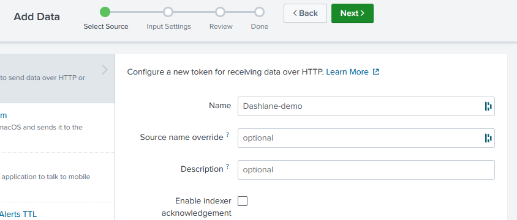
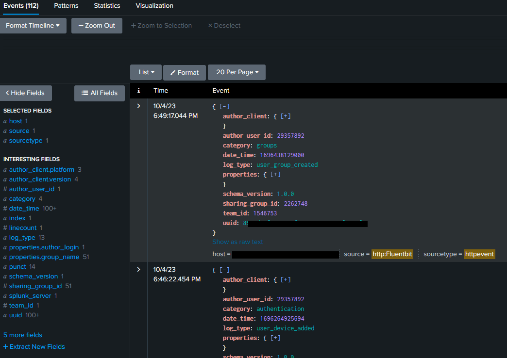

# Dashlane audit logs manager

This projects allows you to retrieve your Dashlane's audit log and send them in the SIEM or storage solution of your choice, using Fluentbit. At the moment, we provide out of the box configurations for the following solutions:
* Azure log analytics workspace
* Azure blob storage
* Splunk
* Elasticsearch

This list is not restrictive, as others destination can be used. You can find the list of supported platforms on Fluentbit's website: https://docs.fluentbit.io/manual/pipeline/outputs

## Prerequisites

In order to manage the Dashlane audit logs of your business account, you need to generate the credentials that will be used to pull the logs. The procedure can be found here: https://dashlane.github.io/dashlane-cli/business

## How does it work ?

The Docker image provided leverages the Dashlane CLI tool that will pull the audit logs and send them in your SIEM of choice. By default, when running the image in a container, the logs from DAY-1 will be retrieved, and new logs will be pulled every minutes. To handle the logs, we included Fluentbit with this basic configuration file:

```
[INPUT]
    Name  stdin
    Tag   dashlane

[OUTPUT]
    Name  stdout
    Match *
    Format json_lines
```

To send the logs to a new destination, you need to enrich this configuration file template and add an **OUTPUT** section such as described on the following sections. To use your custom configuration file, you need to override the **$DASHLANE_CLI_FLUENTBIT_CONF** environment variable and set the path of your configuration file. The method to pass your file will depend on the plaform you use to run the image.

## Accessing the logs

The first step to retrieve the audits logs is to run the custom image we provide and that can be found here: https://hub.docker.com/r/dashlane/audit-logs

This image can run on the platform of your choice. To make a simple test, you can deploy it with Docker by doing so:

### Running in Docker

```
docker pull dashlane/audit-logs
docker run -e DASHLANE_TEAM_UUID=XXX -e DASHLANE_TEAM_ACCESS_KEY=XXX -e DASHLANE_TEAM_SECRET_KEY=XXX -it dashlane/audit-logs:latest
```
Running those commands will create a simple container that pull your business every minutes and and print them on the stdout of the container.


### Kubernetes

A helm chart is provided by the repository to deploy the service on a Kubernetes.

```bash
helm install dashlane-audit-logs dashlane-audit-logs/
```

Some example of configuration is provided in `example/`.

## SIEM configuration

### Azure Log analytics workspace

To send your Dashlane audit logs on Azure in a Log Analytics Workspace, you can use the template provided in this repository. The template will create a container instance that will automatically pull and run the Dashlane Docker image and send the logs in a **ContainerInstanceLog_CL** table in the Log Analytics Workspace of your choice. Before deploying the template you will have to provide:

- The location where you want your container to run (ex: "West Europe")
- Your Dashlane credentials
- Your Log Analytics Workspace ID and Shared Key

>**Click on the button to start the deployment**
>
> [](https://portal.azure.com/#create/Microsoft.Template/uri/https%3A%2F%2Fraw.githubusercontent.com%2FDashlane%2Fdashlane-audit-logs%2Fmain%2FAzureTemplates%2FLog%20Analytics%20Workspace%2Fazuredeploy.json)

### Azure blob storage

If you want to send your logs to an Azure storage account, you need to have the following information:

- Your Dashlane credentials
- Your storage account name
- Your storage account access key

You can deploy the Dashlane Docker image in a container instance by running this simple command and be able to see the logs in the stdout of the container.
```
az container create -g $RESOURCE_GORUP --name dashlane-audit-logs --image sgravis/dcli-log-catcher:0.2 -e DASHLANE_TEAM_UUID=XXX  DASHLANE_TEAM_ACCESS_KEY=XXX DASHLANE_TEAM_SECRET_KEY=XXX STORAGE_ACCOUNT_KEY=XXX
```

As a second step, you need to update your Fluentbit configuration file by adding the following output configuration
```
[OUTPUT]
    name                  azure_blob
    match                 *
    account_name          dashlaneauditlogs
    shared_key            ${STORAGE_ACCOUNT_KEY}
    container_name        fluentbit
    auto_create_container on
    tls                   on
    blob_type             blockblob
```

In this configuration, we are telling Fluentbit to send the logs on a storage account named "dashlaneauditlogs" in the container "fluentbit". Be sure to validate that your Azure configuration matches the Fluentbit output configuration.

> The "blob_type" configuration specifies to create a blob for every log entry on the storage account, which facilitates the logs manipulation for eventual post-processing treatment.

> To pass your custom configuration file, you can create an Azure file share and use it when you create your container, as described here: https://learn.microsoft.com/en-us/azure/container-instances/container-instances-volume-azure-files


## Splunk
If you want to send your logs on Splunk, you need to create a HEC (HTTP Event Collector) on your Splunk instance. As an example, we will show here how to create one on a Splunk Cloud instance.

1- On the Splunk console, go to **"Settings / Data input"** and click on **Add New** in the **HTTP Event Collector** line.


2- Give your collector a name and click **Next**


3- In the **Input settings** tab keep the option as is and click on **Next**

4- In the **Review tab**, click on **Submit**. You should see a page indicating that the collector has been created.


> The token provided will be used to authenticate and send the logs to your Splunk instance.

You can make a test by running the following command:

```
curl -k https://$SPLUNK_URL.com:8088/services/collector/event -H "Authorization: Splunk $SPLUNK_TOKEN" -d '{"event": "Dashlane test"}'
```

If all is working you should receive the following response:
```
{"text":"Success","code":0}
```

Finally, to send your Dashlane logs to Splunk, you need to customize your Fluentbit configuration file by adding the relevant Splunk configuration:

```
[OUTPUT]
    Name        splunk
    Match       *
    Host        splunk-instance.com
    Port        8088
    TLS         On
    TLS.Verify  Off
    splunk_token ${SPLUNK_TOKEN}
```

Here, you just need to change the host parameter and indicate yours, and pass your Splunk token as an environment variable to the container. 
Once the data are sent, you can query them by going to the **"Apps/Search and reporting"** menu in the console and type this basic query in the search bar:

```
index=* sourcetype=*
```

You should now be able to access your Dashlane audit logs:



## Elasticsearch
Work in progress

Output configuration for Elasticsearch

```
[OUTPUT]
  Name  es
  Match *
  Host host
  Port 443
  tls on
  HTTP_User user
  HTTP_Passwd pwd
  Suppress_Type_Name On
```

## Notes:
All configuration are provided as is and designed to work out of the box. If you want customize them, you can consult the Fluentbit documentation: https://docs.fluentbit.io/manual/pipeline/outputs
