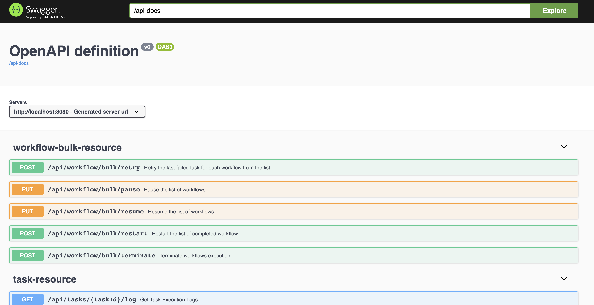

# Building Conductor From Source
## Build and Run

In this article we will explore how you can set up Conductor on your local machine for trying out some of its
features.

### Prerequisites
1. JDK 11 or greater
2. (Optional) Docker if you want to run tests.  You can install docker from [here](https://www.docker.com/get-started/).
3. Node for building and running UI.  Instructions at [https://nodejs.org](https://nodejs.org).
4. Yarn for building and running UI.  Instructions at [https://classic.yarnpkg.com/en/docs/install](https://classic.yarnpkg.com/en/docs/install).

### Steps to build Conductor Server

#### 1. Checkout the code
Clone conductor code from the repo: https://github.com/conductor-oss/conductor

```shell
$ git clone https://github.com/conductor-oss/conductor.git
```
#### 2. Build and run Server

> **NOTE for Mac users**: If you are using a new Mac with an Apple Silicon Chip, you must make a small change to ```conductor/grpc/build.gradle``` - adding "osx-x86_64" to two lines:
```
protobuf {
    protoc {
        artifact = "com.google.protobuf:protoc:${revProtoBuf}:osx-x86_64"
    }
    plugins {
        grpc {
            artifact = "io.grpc:protoc-gen-grpc-java:${revGrpc}:osx-x86_64"
        }
    }
...
} 
```

You may also need to install rosetta:  

```shell
softwareupdate --install-rosetta
``` 

```shell
$ cd conductor
conductor $ cd server
server $ ../gradlew bootRun
```

Navigate to the swagger API docs:
[http://{{ server_host }}/swagger-ui/index.html?configUrl=/api-docs/swagger-config](http://{{ server_host }}/swagger-ui/index.html?configUrl=/api-docs/swagger-config)



## Download and Run
As an alternative to building from source, you can download and run the pre-compiled JAR.

```shell
export CONDUCTOR_VER=3.3.4
export REPO_URL=https://repo1.maven.org/maven2/com/netflix/conductor/conductor-server
curl $REPO_URL/$CONDUCTOR_VER/conductor-server-$CONDUCTOR_VER-boot.jar \
--output conductor-server-$CONDUCTOR_VER-boot.jar; java -jar conductor-server-$CONDUCTOR_VER-boot.jar 
```
Navigate to the swagger URL: [http://{{ server_host }}/swagger-ui/index.html?configUrl=/api-docs/swagger-config](http://{{ server_host }}/swagger-ui/index.html?configUrl=/api-docs/swagger-config)


## Build and Run UI

### Conductor UI from Source

The UI is a standard `create-react-app` React Single Page Application (SPA). To get started, with Node 14 and `yarn` installed, first run `yarn install` from within the `/ui` directory to retrieve package dependencies.


```shell
$ cd conductor/ui
ui $ yarn install
```

There is no need to "build" the project unless you require compiled assets to host on a production web server. If the latter is true, the project can be built with the command `yarn build`.

To run the UI on the bundled development server, run `yarn run start`. Navigate your browser to `http://localhost:5000`. The server must already be running on port 8080. 

```shell
ui $ yarn run start
```

Launch UI [http://localhost:5000](http://localhost:5000)


## Summary
1. By default in-memory persistence is used, so any workflows created or excuted will be wiped out once the server is terminated.
2. Without indexing configured, the search functionality in UI will not work and will result an empty set.
3. See how to install Conductor using [Docker](docker.md) with persistence and indexing.
