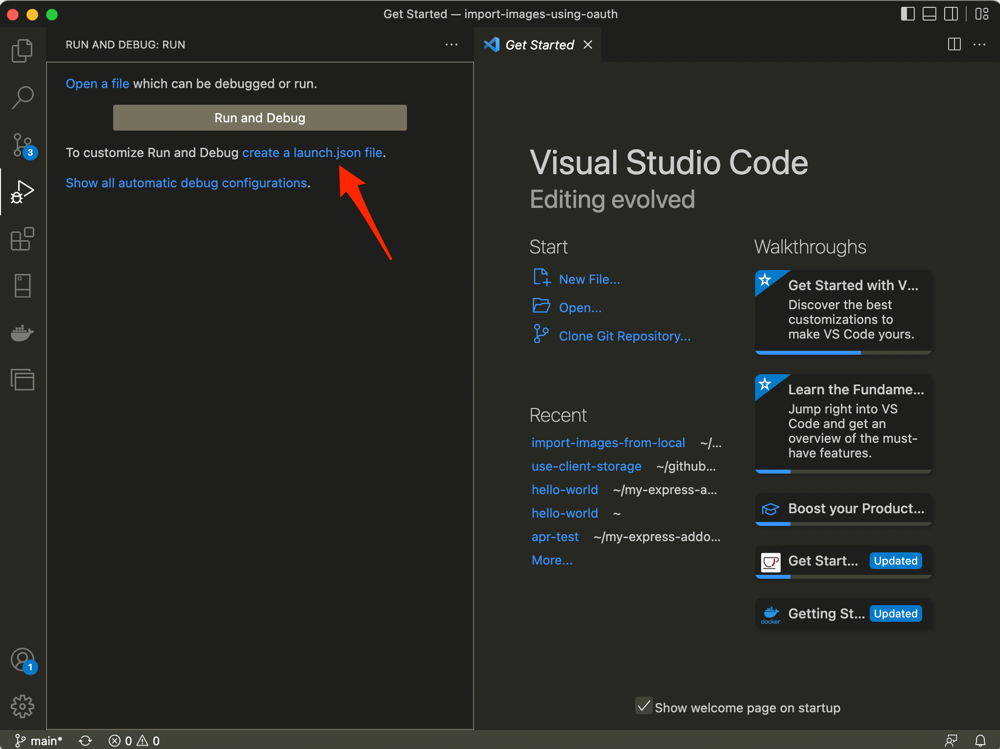
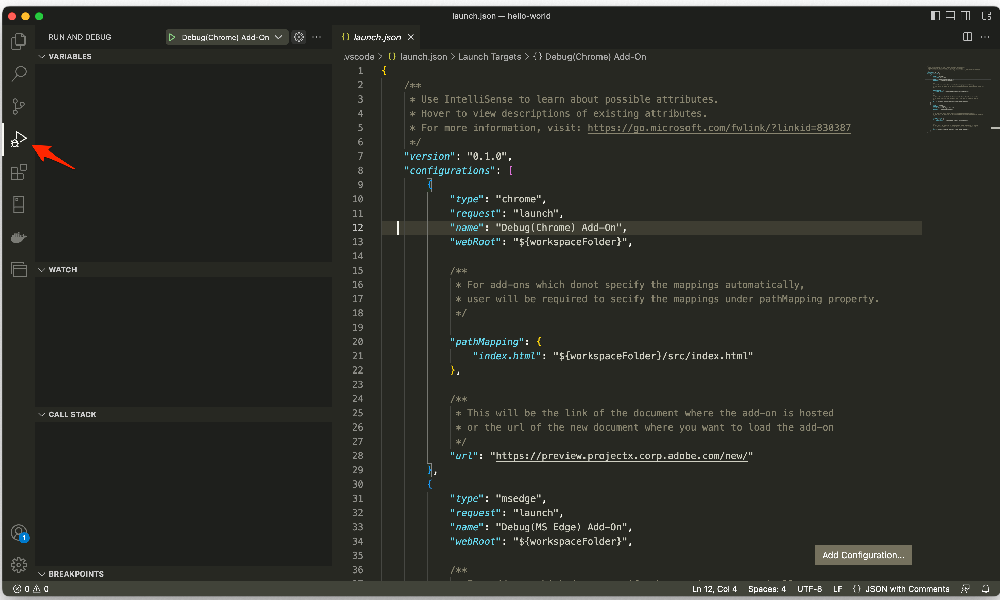
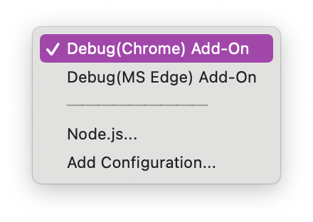
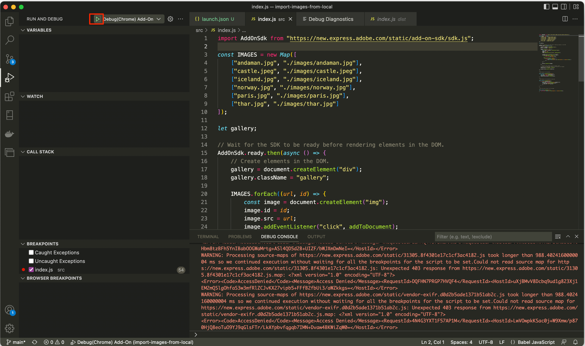
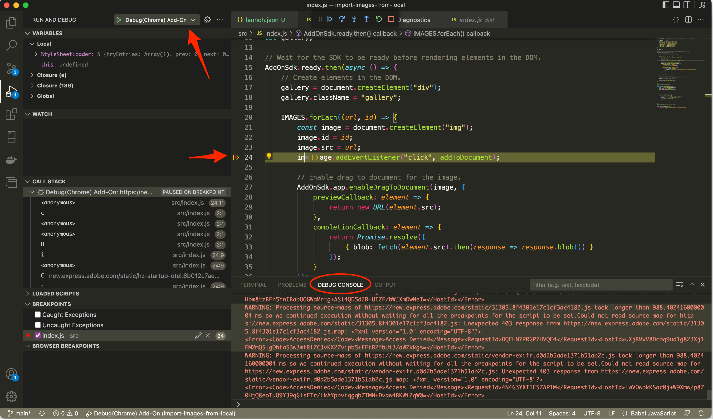
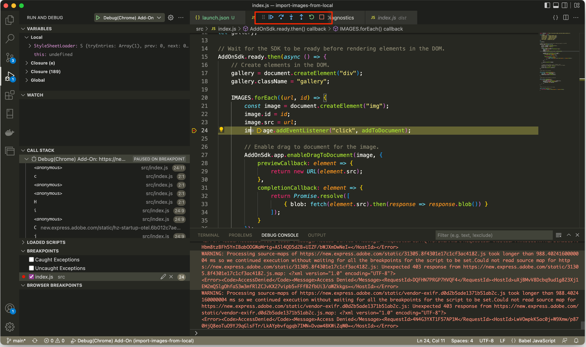

# Debugging with Visual Studio Code 
You can use VS Code to debug your add-ons. An example of this workflow is shown in the video below for reference:

<iframe aria-label="Debugging VS Code Demo" src="https://drive.google.com/file/d/1at1jXCTIi9TZWxwFn11su0PeEQZhUGFC/preview" width="640" height="480"></iframe>


## Steps
The steps to debug in VS Code are also here for quick reference.

- For any add-ons that were generated with the CLI, start by locating the existing `launch.json` file in the `.vscode` folder in the root of your project. Double check to ensure the URL points to `https://new.express.adobe.com/new/`. 

<InlineAlert slots="text,image" variant="info"/>

If it's a sample add-on that you downloaded, you will need to create one first with the "create a launch.json file" and copy in the JSON configuration included below (or copy one in from an add-on you previously generated). 



```json
{
    /**
     * Use IntelliSense to learn about possible attributes.
     * Hover to view descriptions of existing attributes.
     * For more information, visit: https://go.microsoft.com/fwlink/?linkid=830387
     */
    "version": "0.1.0",
    "configurations": [
        {
            "type": "chrome",
            "request": "launch",
            "name": "Debug(Chrome) Add-On",
            "webRoot": "${workspaceFolder}",

            /**
             * For add-ons which donot specify the mappings automatically,
             * user will be required to secify the mappings under pathMapping property.
             */

            "pathMapping": {
                "index.html": "${workspaceFolder}/src/index.html"
            },

            /**
             * This will be the link of the document where the add-on is hosted
             * or the url of the new document where you want to load the add-on
             */
            "url": "https://new.express.adobe.com/new/"
        },
        {
            "type": "msedge",
            "request": "launch",
            "name": "Debug(MS Edge) Add-On",
            "webRoot": "${workspaceFolder}",

            /**
             * For add-ons which donot specify the mappings automatically,
             * user will be required to secify the mappings under pathMapping property.
             */

            "pathMapping": {
                "index.html": "${workspaceFolder}/src/index.html"
            },

            /**
             * This will be the link of the document where the add-on is hosted
             * or the url of the new document where you want to load the add-on
             */
            "url": "https://new.express.adobe.com/new/"
        }
    ]
}
```
- Start your add-on from your terminal as normal with `npm run start`.

- Back in VS Code, click the **Run and Debug** option from the left panel and then select the profile related to where you want to debug (note that Chrome is the first one and selected by default but you can modify your configuration in the `launch.json` to your liking).

    

    

- Once you have your selection set from above, simply hit the green play button outlined below to start debugging.

    

- A new browser window will open for your debugging session directly to the Express URL you configured above. Connect to your add-on as you normally would in Express.

- You can now set breakpoints as desired, and you will see the code execution stop with the line highlighted. You can also check the **DEBUG CONSOLE** window to see any console output directly in VS Code.

  

- Also note the toolbar that's added to the top of your screen in VS Code when you're in debug mode which allows you to step through your code after it's been stopped on a breakpoint. 

    
