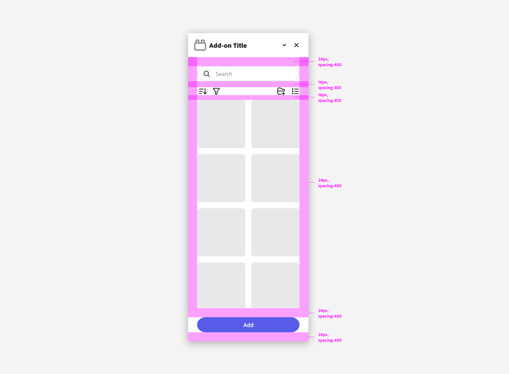
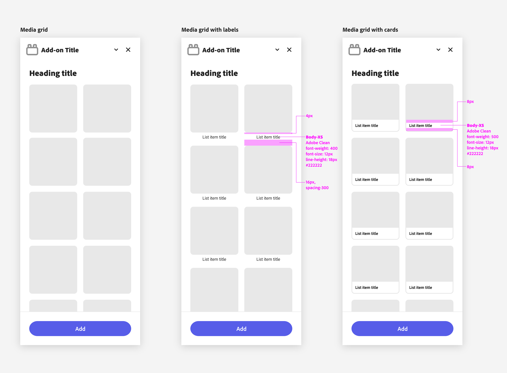

---
keywords:
  - Adobe Express
  - Express Add-on 
  - Extend
  - Extensibility
  - User Interface
  - User Experience
  - UI
  - UX
  - Guidelines
  - Layout
  - Structure
title: Layout & Structure
description: This document provides an overview of the UX guidelines to follow when designing your Adobe Express add-on.
contributors:
  - https://github.com/undavide
---

# Layout & Structure

A well-structured layout sets the stage for a great design.

Adobe Express is built on a clean and consistent structure designed for clarity and usability: add-ons should follow the same rules and blend in.

## Basic Structure

Add-ons on Desktop are assigned a specific width of **320px** and a **100%** height to ensure uniformity within the Adobe Express user interface and its modules. The layout is divided into the following parts: 

- The title bar with the add-on's icon—controlled by Adobe.
- The body holding the add-on's content. 
- Optionally, a footer with Call to Action (CTA) buttons.

### Padding

Padding plays a crucial role in maintaining visual harmony and readability. You should consistently apply the following padding scheme:

- **24px** on the body to create a balanced spacing around the content. An additional padding of the same amount is applied at the footer's bottom.
- **16px** between internal elements to ensure they are appropriately spaced.

This padding structure ensures that content is well-separated and easy to interact with.

### Responsive Grid and Core Container Styles

Adobe Express add-ons rely on a [responsive grid system](https://spectrum.adobe.com/page/responsive-grid/). Core container styles define a few key media sizes:

- **272x128px** for banners.
- **128x128px** tops for standard media.
- **80x80px** for smaller media items.

Remember to apply the standard gap of 16px between grid elements for consistency.

### Panel Structure and core content actions

Panel structure in Adobe Express add-ons is designed to support core content actions, such as searching, sorting, and filtering. These actions are typically placed at the top of the panel for easy access, between the title and main body.

### Structural Grids and Foundational Patterns

Structural grids in Adobe Express add-ons are designed to accommodate various content types, from simple lists to more visually complex media grids. Three of the container variants are as follows:

- **Media Grid:** A straightforward grid for displaying media items.
- **Media Grid with Labels:** Enhances the basic grid by adding labels beneath each item, ensuring clarity.
- **Media Grid with Cards:** Adds a card-like structure on each media item.

Please note the specific paddings on each of these grid types.

