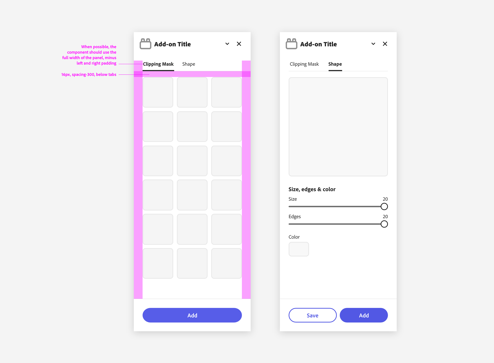

---
keywords:
  - Adobe Express
  - Express Add-on 
  - Extend
  - Extensibility
  - User Interface
  - User Experience
  - UI
  - UX
  - Guidelines
  - Navigation
title: Navigation
description: This document provides an overview of the UX guidelines to follow when designing your Adobe Express add-on.
contributors:
  - https://github.com/undavide
---

# Navigation

Navigation is a key component of any user interface. It helps users understand where they are, where they can go, and how to get there. Spectrum provides a few components that we recommend to help you build a clear and consistent navigation system for your add-on.

## Tabs

Tabs organize content into multiple sections and allow users to navigate between them; the content under the set of tabs should be related and form a coherent unit. Please always include a label for accessibility.

## Accordions

The [Accordion](https://opensource.adobe.com/spectrum-web-components/components/accordion/) element contains a list of items that can be expanded or collapsed to reveal additional content or information associated with each item. There can be zero expanded items, exactly one expanded item or more than one item expanded at a time, depending on the configuration. This list of items is defined by child elements that are targeted to the default slot of their parent.

