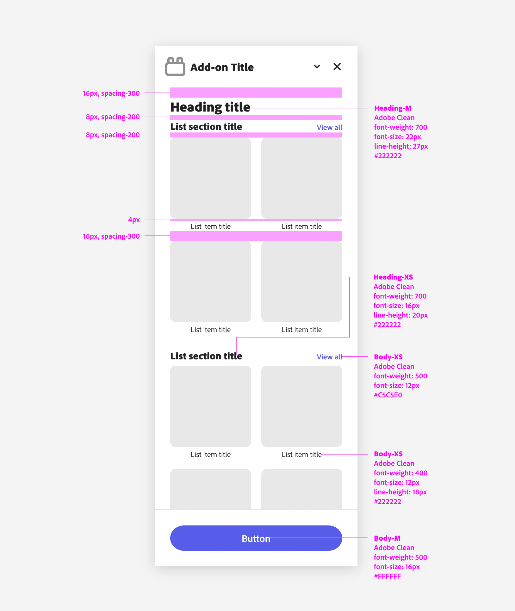

---
keywords:
  - Adobe Express
  - Express Add-on 
  - Extend
  - Extensibility
  - User Interface
  - User Experience
  - UI
  - UX
  - Guidelines
  - Visual Elements
title: Visual Elements
description: This document provides an overview of the UX guidelines to follow when designing your Adobe Express add-on.
contributors:
  - https://github.com/undavide
---

import '/src/styles.css'

# Visual Elements

Adobe Express implements the "Spectrum for Adobe Express theme", which has been designed specifically for it. You’ll notice a friendlier visual tone, with bolder typography, softer rounding on elements, and indigo serving as the accent color.

## Color

TODO: Ask someone what to say about color

## Typography

Spectrum is based on the Adobe Clean and Adobe Clean Han typefaces. The former is used for Latin characters, while the latter is for Simplified Chinese, Traditional Chinese, Japanese, and Korean ones.

<!-- 

  

    
  

  

    <h3>Headings</h3>
    
Headings in Spectrum for Adobe Express always use bolder typography. The default and heavy weights both rely on Adobe Clean Black (Sans Serif).

  

 -->

### Headings

Headings in Spectrum for Adobe Express use bolder typography. The default weight is 700 (Adobe Clean Black, Sans Serif), with a size ranging from M to XXS.

### Body Text

The available sizes for body text in Spectrum for Adobe Express span from L to XXS, while the weight is usually around 400-500.

### Usage

Here's an example of how you can implement the Adobe Clean typeface in your add-on; please note the recommended spacing between text and other user interface elements.

