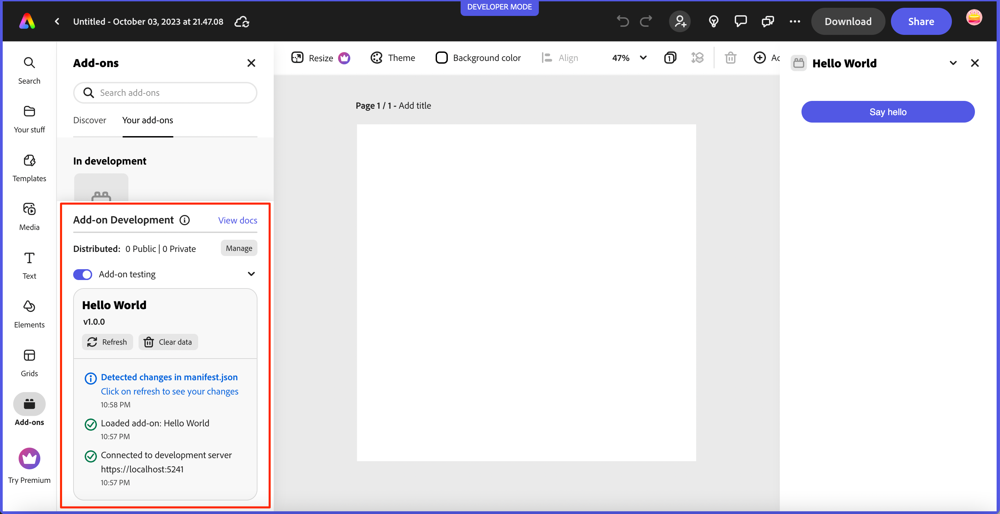
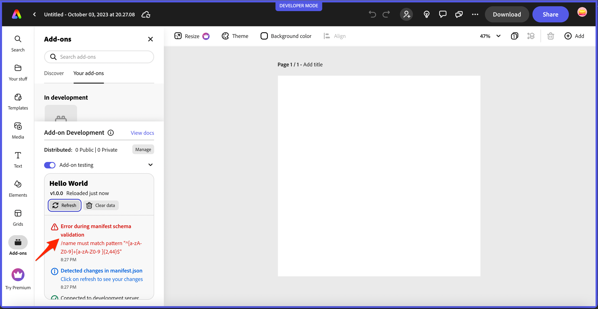

---
keywords:
  - Adobe Express
  - Express Add-on SDK
  - Express Editor
  - Adobe Express
  - Add-on SDK
  - SDK
  - JavaScript
  - Extend
  - Extensibility
  - API
  - Add-on Manifest
title: Quickstart
description: This is the Quickstart page
contributors:
  - https://github.com/hollyschinsky
---

<InlineAlert slots="text" variant="info"/>

Preview Adobe Express add-on SDK documentation while you wait to [join our private beta](https://adobe.com/go/express-developer).

# Development Tools

## Using the CLI
The add-on CLI (Command Line Interface) is the main tool that enables you to develop, test, and package add-ons for our platform. With the add-on CLI, you can create a new add-on project, build and test your add-on locally, and package your add-on for distribution.

Here are some key features of the add-on CLI:
- **Project creation:** The add-on CLI provides a command to create a new add-on project with a basic file structure and configuration.
- **Local development:** The add-on CLI includes a built-in server that allows you to test your add-on locally before deploying it to our platform.
- **Live reloading:** The add-on CLI watches your project files for changes and automatically reloads the server when a change is detected.
- **Packaging:** The add-on CLI provides a command to package your add-on for distribution, including creating a ZIP file that can be uploaded to our platform.

### CLI `create` Options
The table below shows the list of arguments that can be specified with the CLI create command (ie: `npx @adobe/create-ccweb-add-on`):

| Argument      | Optional | Default Value                                | Description                                                                                                          |
| ------------- | -------- | -------------------------------------------- | -------------------------------------------------------------------------------------------------------------------- |
| `add-on-name` | No       |                                              | Name of the add-on. A new add-on project with this argument will be created in the user's current working directory. |
| `template`    | Yes      | none, you will<br/> be prompted from the CLI | The template to use for creating the add-on.                                                                         |
| `verbose`     | Yes      | false                                        | Setting this argument enables the verbose flag on the underlying operations.                                         |

For instance, the following command would specify all possible arguments:

```bash
npx @adobe/create-ccweb-add-on my-addon --template react-typescript --verbose
```

<InlineAlert slots="text" variant="info"/>

See the [templates](#templates) section for the currently supported template values.

### `start` Script Options
The table below shows a list of arguments that can be specified with the `start` script on your add-on project, which starts up the add-on in a local server:

| Argument  | Optional | Default Value | Description                                                                  |
| --------- | -------- | ------------- | ---------------------------------------------------------------------------- |
| `src`     | Yes      | `src`         | Directory where the source code and assets for the add-on is present.        |
| `use`     | Yes      |               | Transpiler/bundler to be used. For example, webpack.                         |
| `port`    | Yes      | `5241`        | Local development server port.                                               |
| `verbose` | Yes      | false         | Setting this argument enables the verbose flag on the underlying operations. |

For instance, to specify a port of `8080` instead, use the following command:

```bash
npm run start -- --port 8080
```

To specify you want to use `webpack` AND port `8080`:

```bash
npm run start -- --use webpack --port 8080
```

<InlineAlert slots="text" variant="info"/>

The extra arguments are unnecessary unless you do not want to use a transpiler/bundler or use the default port of `5241`. Also, note that all of the templates other than the `javascript` template are pre-configured to use webpack by default and the `--use webpack` is automatically added when you run the `build` and `start` commands. Take a look at the `scripts` property in the `package.json` of those templates and you will see the following:

```json
"scripts": {
    "clean": "ccweb-add-on-scripts clean",
    "build": "ccweb-add-on-scripts build --use webpack",
    "start": "ccweb-add-on-scripts start --use webpack"
}
```

## Templates
The add-on CLI contains built-in, pre-configured templates to allow you to create an add-on project based on your favorite development stack in the quickest possible manner. There are currently four different template options based on popular web development trends. The table below summarizes the templates and their associated frameworks.
<br/>


| Template         | Framework        |
| ---------------- | ---------------- |
| `javascript`       | JavaScript       |
| `typescript`       | TypeScript       |
| `react-javascript`  | React with JavaScript |
| `react-typescript` | React with TypeScript |


The following syntax can be used to specify one of the above templates:

```bash
npx @adobe/create-ccweb-add-on <add-on-name> --template <template>
```

For instance, the following is an example of a command that will create an add-on based on the `react-javascript` template:

```bash
npx @adobe/create-ccweb-add-on helloworld-react-js --template react-javascript
```


<InlineAlert slots="text" variant="success"/>

**TIP:** If you don't specify a template, the CLI will simply prompt you to choose from the list of template options.


## Manifest
A `manifest.json` file is required in every add-on project. The manifest provides details including important metadata about your add-on and how it should behave. Be sure to consult the [manifest schema reference](../references/manifest.md) to ensure that your `manifest.json` file is properly formatted and includes all the necessary properties and values.


## Add-on Development Tools Panel
The **Add-on Development** tools panel provides useful logging details indicating the status of your add-on, as well as action buttons to allow for refreshing and clearing the data associated with your add-on. The panel is shown in the screenshots below for reference:

<InlineAlert slots="text" variant="info"/>

The **Refresh** button can be used to reload your add-on's code and resources, and the **Clear Storage** button allows you to clear any data stored by your add-on.





