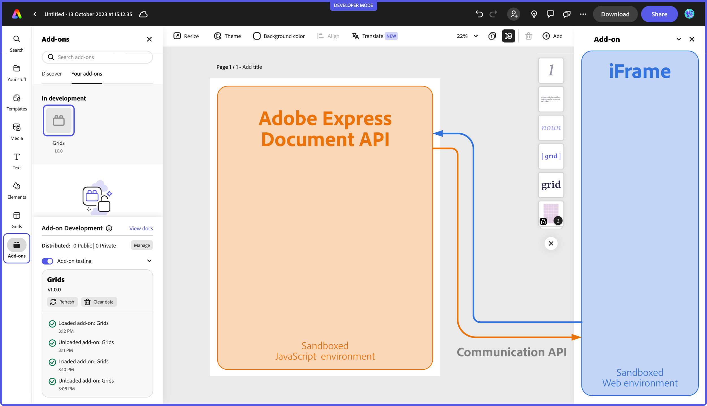
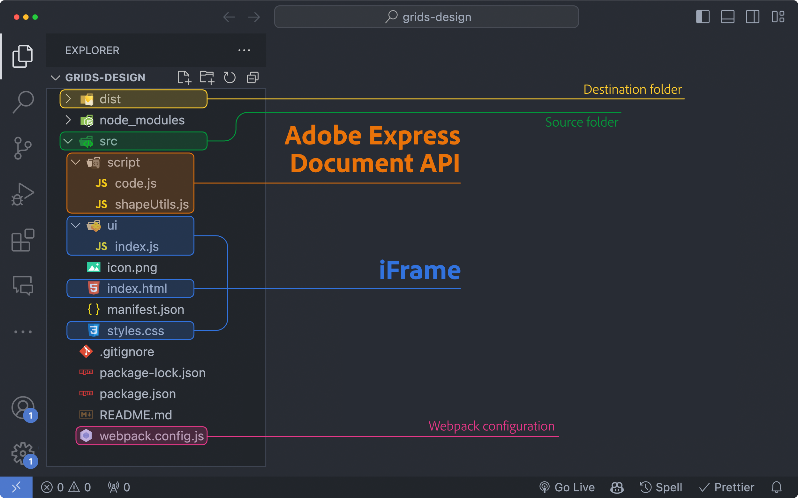

---
keywords:
  - Adobe Express
  - Express Add-on SDK
  - Express Editor
  - Adobe Express
  - Add-on SDK
  - SDK
  - JavaScript
  - Extend
  - Extensibility
  - API
  - Add-on Manifest
title: Document API tutorial
jsDoc: true
description: This is a Document API in-depth tutorial
contributors:
  - https://github.com/undavide
---

# Document API tutorial

This tutorial will guide you through the creation of your first Express add-on based on the Document API.

## Introduction

We'll build a fully functional Grids System add-on from scratch. Grid systems are widely used in the design world to bring structure and consistency to all visual content, from flyers to web pages or social media posts.


Your add-on will allow users to create a variable number of rows and columns, controlling the gutter and color overlays.
### Prerequisites

- Familiarity with HTML, CSS, JavaScript and the Adobe Express add-ons environment. If you need a refresher, follow the [quickstart](/guides/getting_started/quickstart.md) guide.
- An Adobe Express account; use your existing Adobe ID or create one for free.
- Node.js version 16 or newer.

### Topics Covered

<!-- List block here -->
<ListBlock slots="text1, text2" repeat="4" iconColor="#2ac3a2" icon="disc" variant="fullWidth" />

iFrame and Script Runtime communication

Spectrum Web Components

Document API

Color Pickers

Nodes insertion point

Creating and manipulating shapes

Grouping elements

Context permanence

### Getting Started with the Document API

As part of the [Script Runtime](/references/scriptruntime/index.md), the Document API is a powerful tool that extends the capabilities of Adobe Express add-ons, offering direct interaction with the open document. Let's take a moment to review the difference between the two core components of add-ons' architecture.

- The **iFrame** hosts the add-on User Interface and runs its internal logic. You can think about it as a web application operating in a sandboxed environment: it needs to be separate from the rest of the Adobe Express content for security reasons, which is precisely why the add-on is hosted within an `<iframe>` element (a detailed technical description is found [here](/guides/develop/context.md#iframe-sandbox)). If you come from a CEP/UXP background, it's akin to developing the panel of an extension or plugin.
- The **Script Runtime**: allows you to operate on the document. It's a sandboxed JavaScript environment that communicates with the iFrame (thanks to the [Communication API](/references/scriptruntime/communication/)), providing access to the [Document API](/references/scriptruntime/editor/). Drawing the parallel with CEP and UXP again, it represents scripting; that is, the possibility to drive Express programmatically and, for example, add pages or artboards, create new shapes, rotate or group them, etc.

This is a high-level overview of the overall structure; while the implementation has more technical nuances, there's no need to dive deeper now. <span id="fig-communication-api"></span>



### The Project Structure

The complete code for the Grids System add-on can be found [here](#), although it would be best if you followed along, starting from this [blank template](#): it sets up a JavaScript/Webpack environment with everything we need to complete the project. You can download the code, `cd` in the `grids-design` folder and then:

```bash
npm install
npm run build
npm run start
```

This will install the required dependencies, build the project, and then serve it locally on port 5241; if you need more clarification about how to load an add-on in Adobe Express, please refer to the [quickstart](/guides/getting_started/quickstart.md) guide for a step-by-step walkthrough.

Before jumping into the code, let's look at how the project is structured. At the time of this writing, the CLI provides a few templates, but Only ReactJS-based ones have a Webpack configuration, which is handy when using Spectrum Web Components (SWC). This project provides both hooks to the Script Runtime and the development environment needed to use SWCs.



As usual, we'll work in the `src` folder while Webpack outputs the result in `dist`. The add-on entry point is `index.html`, which relies on `ui/index.js` for the iFrame logic code (UI element handlers, etc.). The Document API entry point is instead `script/code.js`, as defined in the `manifest.json`:

```json
{
	// ...
	"entryPoints": [
		{
			"type": "panel",
			"id": "panel1",
			"main": "index.html",
			"script": "code.js"    // 👈 here
		}
	]
}
```

If you're wondering about `script/shapeUtils.js`, it is an auxiliary file containing private code consumed by `script.js` that doesn't need to be exposed to the iFrame. The code of the blank template is as follows. <span id="code-start"></span>

<!-- Code below -->
<CodeBlock slots="heading, code" repeat="3" languages="index.html, index.js, code.js"/>

#### iFrame 

```html
<!DOCTYPE html>
<html lang="en">

<head>
    <meta charset="UTF-8" />
    <meta name="description" content="Design Grid creator Adobe Express add-on" />
    <meta name="keywords" content="Adobe, Express, Add-On, JavaScript, Script Runtime" />
    <meta name="viewport" content="width=device-width, initial-scale=1.0" />
    <title>Grids add-on</title>
    <link rel="stylesheet" href="styles.css">
</head>

<body>
    <sp-theme scale="medium" color="light" theme="express">
        <sp-button id="createShape">Create shape</sp-button>
    </sp-theme>
</body>

</html>
```

#### iFrame 

```js
// Spectrum imports
import "@spectrum-web-components/styles/typography.css";
import "@spectrum-web-components/theme/src/themes.js";
import "@spectrum-web-components/theme/theme-light.js";
import "@spectrum-web-components/theme/express/theme-light.js";
import "@spectrum-web-components/theme/express/scale-medium.js";
import "@spectrum-web-components/theme/sp-theme.js";

// SDK import
import addOnUISdk from "https://new.express.adobe.com/static/add-on-sdk/sdk.js";

addOnUISdk.ready.then(async () => {
  console.log("addOnUISdk is ready for use.");
  const createShapeButton = document.getElementById("createShape");

  // Get the UI runtime.
  const { runtime } = addOnUISdk.instance;
  const scriptApi = await runtime.apiProxy("script");
  scriptApi.log("Script runtime up and running.");

  // Enabling CTA elements only when the addOnUISdk is ready
  createShapeButton.disabled = false;
});

```

#### Document API

```js
// code.js
import addOnScriptSdk from "AddOnScriptSdk";
const { runtime } = addOnScriptSdk.instance;

function start() {
  runtime.exposeApi({
    log: (...args) => {
      console.log(...args);
    },
    // add other properties here
  });
}

start();
```

The `index.html` contains a `<sp-theme>` wrapper, whose role is explained [here](/guides/design/user_interface.md#spectrum-web-components-with-express-theme), and just a button. There's already something going on in `index.js` and `code.js` instead, which we must understand.
## The Communication API

A crucial component of any add-on that consumes the Document API is the communication bridge with the iFrame. As we've seen in [this figure](#fig-communication-api), it's precisely the role of the Communication API. 

The mechanism is straightforward: through the `runtime` object ([`code.js`](#code-start), line 2), you can invoke the `exposeApi()` method, which grants the iFrame access to the object literal that's its parameter. The iFrame must get to the `runtime`, too, and use the `apiProxy()` method passing `"script"`. This asynchronous call results in the same object whose `log()` can now be invoked.


It would not be uncommon to define an object literal first and pass it to the `exposeAPI` later; in any case, mind the syntax in case you need the functions to call each other. For instance, the following won't work, as arrow functions' `this` is inherited from the enclosing scope, and there's none provided.

```js
runtime.exposeApi({
	log: (...args) => {
		console.log(...args);
	},
	createShape: (shape) => {
		// ...
		this.log("Shape created."); // ❌
	}
});
```

Using the *method shorthand syntax* provides a proper `this` reference instead.

```js
runtime.exposeApi({
	log(...args) {
		console.log(...args);
	},
	createShape(shape) {
		// ...
		this.log("Shape created.");  // ✅
	},
});
```


## Another chapter


## Another chapter


## Another chapter


## Another chapter


## Final Project

<!-- Code below -->
<CodeBlock slots="heading, code" repeat="4" languages="index.html, index.js, code.js, shapeUtils.js" />

#### iFrame 

```html
<!DOCTYPE html>
<html lang="en">

<head>
    <meta charset="UTF-8" />
    <meta name="description" content="Design Grid creator Adobe Express add-on" />
    <meta name="keywords" content="Adobe, Express, Add-On, JavaScript, Script Runtime" />
    <meta name="viewport" content="width=device-width, initial-scale=1.0" />
    <title>Grids add-on</title>
    <link rel="stylesheet" href="styles.css">
</head>

<body>
    <sp-theme scale="medium" color="light" theme="express">
        <h2>Design Grid creator</h2>
        <div class="row gap-20">
            <div class="row">
                <div class="column">
                    <sp-field-label for="rows" size="m">Rows</sp-field-label>
                    <sp-number-field id="rows"></sp-number-field>
                </div>
                <sp-swatch id="rowsColorSwatch" class="color-well"></sp-swatch>
                <input type="color" id="rowsColorPicker" style="display: none;">

            </div>
            <div class="row">
                <div class="column">
                    <sp-field-label for="cols" size="m">Columns</sp-field-label>
                    <sp-number-field id="cols"></sp-number-field>
                </div>
                <sp-swatch id="colsColorSwatch" class="color-well"></sp-swatch>
                <input type="color" id="colsColorPicker" style="display: none;">
            </div>
        </div>
        <div class="row">
            <sp-slider label="Gutter" id="gutter" variant="filled" editable hide-stepper min="1" max="50"
                step="1"></sp-slider>
        </div>
        <sp-button-group horizontal>
            <sp-button id="deleteGrid" disabled>Delete</sp-button>
            <!-- <sp-button id="editGrid" disabled>Edit</sp-button> -->
            <sp-button id="createGrid" disabled>Create</sp-button>
        </sp-button-group>
    </sp-theme>
</body>
</html>
```

#### iFrame 

```js
import "@spectrum-web-components/styles/typography.css";
import "@spectrum-web-components/theme/src/themes.js";
import "@spectrum-web-components/theme/theme-dark.js";
import "@spectrum-web-components/theme/theme-light.js";
import "@spectrum-web-components/theme/express/theme-light.js";
import "@spectrum-web-components/theme/express/theme-dark.js";
import "@spectrum-web-components/theme/express/scale-medium.js";
import "@spectrum-web-components/theme/sp-theme.js";
import "@spectrum-web-components/button/sp-button.js";
import "@spectrum-web-components/button-group/sp-button-group.js";
import "@spectrum-web-components/field-label/sp-field-label.js";
import "@spectrum-web-components/number-field/sp-number-field.js";
import "@spectrum-web-components/slider/sp-slider.js";
import "@spectrum-web-components/swatch/sp-swatch.js";
import addOnUISdk from "https://new.express.adobe.com/static/add-on-sdk/sdk.js";

addOnUISdk.ready.then(async () => {
  console.log("addOnUISdk is ready for use.");

  // Get the UI runtime.
  const { runtime } = addOnUISdk.instance;
  const scriptApi = await runtime.apiProxy("script");

  // Input fields -------------------------------------------

  const rowsInput = document.getElementById("rows");
  const colsInput = document.getElementById("cols");
  const gutterInput = document.getElementById("gutter");

  rowsInput.value = 4;
  colsInput.value = 6;
  gutterInput.value = 10;

  // Color pickers ------------------------------------------

  const colsColorPicker = document.getElementById("colsColorPicker");
  const colsColorSwatch = document.getElementById("colsColorSwatch");
  const rowsColorPicker = document.getElementById("rowsColorPicker");
  const rowsColorSwatch = document.getElementById("rowsColorSwatch");

  colsColorPicker.value = "#ffcccc";
  colsColorSwatch.color = "#ffcccc";
  rowsColorPicker.value = "#ccccff";
  rowsColorSwatch.color = "#ccccff";

  colsColorSwatch.addEventListener("click", function () {
    colsColorPicker.click();
  });
  colsColorPicker.addEventListener("input", function (event) {
    const selectedColor = event.target.value;
    colsColorSwatch.setAttribute("color", selectedColor);
  });

  rowsColorSwatch.addEventListener("click", function () {
    rowsColorPicker.click();
  });
  rowsColorPicker.addEventListener("input", function (event) {
    const selectedColor = event.target.value;
    rowsColorSwatch.setAttribute("color", selectedColor);
  });

  // CTA Buttons --------------------------------------------

  const createGridBtn = document.getElementById("createGrid");
  const deleteGridBtn = document.getElementById("deleteGrid");

  deleteGridBtn.onclick = async (event) => {
    await scriptApi.deleteGrid();
  };

  createGridBtn.onclick = async (event) => {
    await scriptApi.addGrid({
      columns: colsInput.value,
      rows: rowsInput.value,
      gutter: gutterInput.value,
      columnColor: colsColorPicker.value,
      rowColor: rowsColorPicker.value,
    });
  };

  // Only now we can enable the button
  createGridBtn.disabled = false;
  deleteGridBtn.disabled = false;
});

```

#### Document API

```js
import addOnScriptSdk from "AddOnScriptSdk";
import { editor } from "express";
import { addColumns, addRows } from "./shapeUtils";

// Get the Script runtime.
const { runtime } = addOnScriptSdk.instance;

var gridRef = null;

function start() {
  // APIs to be exposed to the UI runtime
  // i.e., to the `index.html` file of this add-on.
  const scriptApi = {
    addGrid({ columns, rows, gutter, columnColor, rowColor }) {
      console.log("addGrid", columns, rows, gutter, columnColor, rowColor);
      const doc = editor.documentRoot;
      const page = doc.pages.first;

      const rowGroup = addRows(rows, gutter, rowColor);
      const columnGroup = addColumns(columns, gutter, columnColor);

      const gridGroup = editor.createGroup();
      page.artboards.first.children.append(gridGroup);
      gridGroup.children.append(rowGroup, columnGroup);
      gridGroup.locked = true;
      gridRef = gridGroup;
      console.log("gridGroup", gridGroup);
    },
    deleteGrid() {
      console.log("deleteGrid", gridRef);
      if (gridRef) {
        try {
          console.log("in here");
          gridRef.removeFromParent();
          gridRef = null;
        } catch (error) {
          console.error(error);
        }
      } else {
        console.log("No grid to delete");
      }
    },
  };

  // Expose `ScriptApi` to the UI runtime.
  runtime.exposeApi(scriptApi);
}

start();
```

#### Document API

```js
import { editor, utils, Constants } from "express";

const hexToColor = (hex) => {
  // Ensure the hex value doesn't have a "#" at the beginning
  if (hex.startsWith("#")) {
    hex = hex.slice(1);
  }

  // Extract red, green, and blue hex values
  const redHex = hex.slice(0, 2);
  const greenHex = hex.slice(2, 4);
  const blueHex = hex.slice(4, 6);

  // Convert hex values to decimal values
  const red = parseInt(redHex, 16) / 255;
  const green = parseInt(greenHex, 16) / 255;
  const blue = parseInt(blueHex, 16) / 255;

  return utils.createColor(red, green, blue);
};

// Utility to create a rectangle and fill it with a color.
const createRect = (width, height, color) => {
  const rect = editor.createRectangle();
  rect.width = width;
  rect.height = height;
  // Fill the rectangle with the color.
  const rectangleFill = editor.createColorFill(hexToColor(color));
  rect.fills.append(rectangleFill);
  return rect;
};

const addRows = (rowsNumber, gutter, color) => {
  console.log("addRows", rowsNumber, gutter, color);
  const doc = editor.documentRoot;
  const page = doc.pages.first;

  var rows = [];
  const rowHeight = (page.height - (rowsNumber + 1) * gutter) / rowsNumber;
  for (let i = 0; i < rowsNumber; i++) {
    let r = createRect(page.width, rowHeight, color);
    r.translateY = gutter + (gutter + rowHeight) * i;
    rows.push(r);
  }
  rows.forEach((row) => page.artboards.first.children.append(row));

  const rowsGroup = editor.createGroup();
  page.artboards.first.children.append(rowsGroup);
  rowsGroup.children.append(...rows);
  // rowsGroup.opacity = rowsOpacity;
  rowsGroup.blendMode = Constants.BlendModeValue.multiply;
  rowsGroup.locked = true;
  return rowsGroup;
};

const addColumns = (columNumber, gutter, color) => {
  // const context = editor.context;
  const doc = editor.documentRoot;
  const page = doc.pages.first;

  var cols = [];
  const colWidth = (page.width - (columNumber + 1) * gutter) / columNumber;
  for (let i = 0; i < columNumber; i++) {
    let r = createRect(colWidth, page.height, color);
    r.translateX = gutter + (gutter + colWidth) * i;
    cols.push(r);
  }
  cols.forEach((col) => page.artboards.first.children.append(col));

  const columnsGroup = editor.createGroup();
  page.artboards.first.children.append(columnsGroup);
  columnsGroup.children.append(...cols);
  //   columnsGroup.opacity = columnsOpacity;
  columnsGroup.blendMode = Constants.BlendModeValue.multiply;
  columnsGroup.locked = true;
  return columnsGroup;
};

export { addColumns, addRows };

```