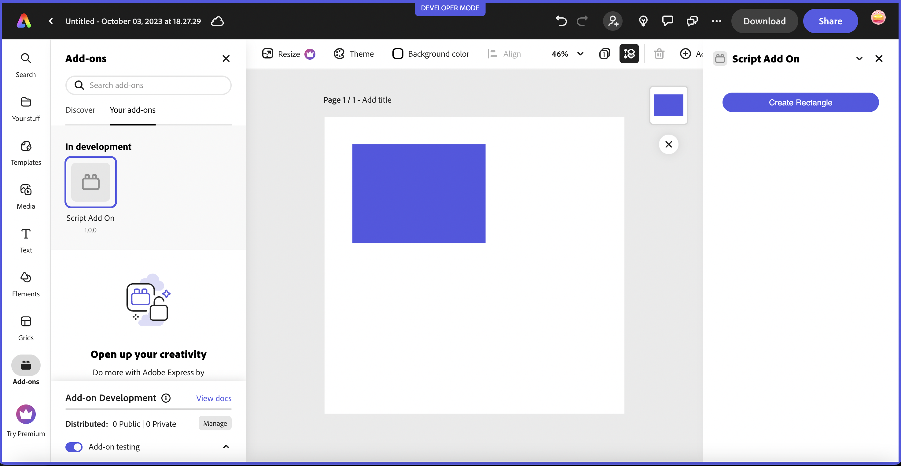

# Script Runtime
The script runtime is a sandboxed JavaScript execution environment, which allows to execute add-on's JavaScript code securely and synchronously in another JavaScript environment e.g., browser.

<InlineAlert slots="text" variant="warning"/>

The script runtime is not currently available to developers. The documentation on this page for informational purposes only.

<InlineAlert slots="text" variant="warning"/>

The script runtime references are currently **experimental only**, so you will need to set `experimentalApis` flag to `true` in the [`requirements`](../manifest/index.md#requirements) section of the `manifest.json` to use them. *Please do not use these APIs in any add-ons you plan to distribute or submit with updates until they have been deemed stable.*

## Overview
The script runtime exposes three categories of APIs, which each have their own specific references and are outlined below.

### Communication APIs
The [communication APIs](./communication/) allow you to communicate between the script runtime and the iframe runtime where your add-on is running via exposed APIs.  

### Web APIs
The script runtime does NOT provide a full fledged browser’s JavaScript execution environment. Most of the browsers APIs/Global Objects are not available in Script Runtime. For these, the developers can use iframe runtime environment and [communicate](./communication/#expose-apis-from-the-ui) the result back to the script running inside script runtime environment. Some of the commonly used [Web APIs](./web/) (with limited scope) have been provided inside script runtime environment.

### Editor APIs
The [editor APIs](./editor/) provide access to the user's document structure and properties, and allow you to make changes to it via the provided APIs.

## Script Runtime JavaScript Engine
The script runtime is a sandboxed JavaScript execution environment, which allows to execute add-on's JavaScript code securely and synchronously in another JavaScript environment e.g., browser.
Some key concepts to note about the script runtime include:

- Limited access to browser APIs (see the [Web APIs](./web/) reference). Note however, you can use the [communication APIs](./communication/) to expose browser APIs (ie: `fetch`) from the iframe environment to be used in the script runtime.
- Runs in a slower execution environment.
- Provides no debugging capabilities other than those provided by the [injected `console` functions](../web/index.md#injected-objects).
- Runs in the same context/thread as the host's application business logic, thus providing access to interact with it via the injected APIs.

## Getting Started with the APIs
The methods defined in the [communication API reference](./communication/) are used to expose and use the API proxies between the iframe and script environments of your add-on. Start with the [communication reference](./communication/) to learn more about how to expose APIs and use them from either  environment.

### Script entry point
To use the script runtime in your add-on, start by defining a new `script` entry point in your `manifest.json` file with the value set to the name of the file containing the JavaScript code you're using with the script runtime functions: 

```json
    "entryPoints": [
        {
            "type": "panel",
            "id": "panel1",
            "main": "index.html",
            "script": "code.js" 
        }
    ]
```

The JavaScript code in the file referenced can then access any of the injected global objects and module APIs defined in all of the APIs outlined in this set of references ([communication APIs](./communication/), [Web APIs](./web/) and [editor APIs](./editor/).

## Code Samples
The following [code samples](https://github.com/AdobeDocs/express-add-on-samples/tree/main/script-runtime-samples) have been provided to help you get started using these new script runtime APIs.

### [communication-iframe-script-runtime sample](https://github.com/AdobeDocs/express-add-on-samples/tree/main/script-runtime-samples/communication-iframe-script-runtime)
Demonstrates the use of the communication APIs to expose and proxy APIs bidirectionally between the iframe and script runtime environments. Also includes demonstrating how to use some of the [Web APIs](./web/) such as `setTimeout()` and `console.log()`.

### [editor-apis sample](https://github.com/AdobeDocs/express-add-on-samples/tree/main/script-runtime-samples/editor-apis)
Demonstrates how to use the [editor APIs](./editor/) to create various shapes and add them to the document. 

### [image-and-page sample](https://github.com/AdobeDocs/express-add-on-samples/tree/main/script-runtime-samples/image-and-page) 
A more comprehensive example of using the [editor APIs](./editor/) to add a page, images and shapes, as well as clear the artboard.

## Debugging script based add-ons
Debugging with breakpoints from the script runtime (via `code.js`) is currently not supported and for the time-being, only console logging (via `console.log()`) can be used. However, support for debugging by applying breakpoints in the code will be available in the near future. Please refer to [Example Code Snippet](./editor/#example-code-snippet), where a `rectangle` object is printed to console for debugging purpose.

## CLI template for script based add-on 
The add-on CLI contains built-in, pre-configured templates to allow you to create an add-on project based on your favorite development stack in the quickest possible manner. There are currently five different template options available. To get started with script based add-on using javascript with editor APIs, you must choose the template named `javascript-with-editing-apis`. Please refer to [Using the CLI](../../guides/getting_started/dev_tooling/#using-the-cli) section to get more information on how to use the CLI and create new add-on.
<br/>

The sample script based add-on created using template named `javascript-with-editing-apis` will look as shown from [Add-on Development Tools Panel](../../guides/getting_started/dev_tooling#add-on-development-tools-panel):


